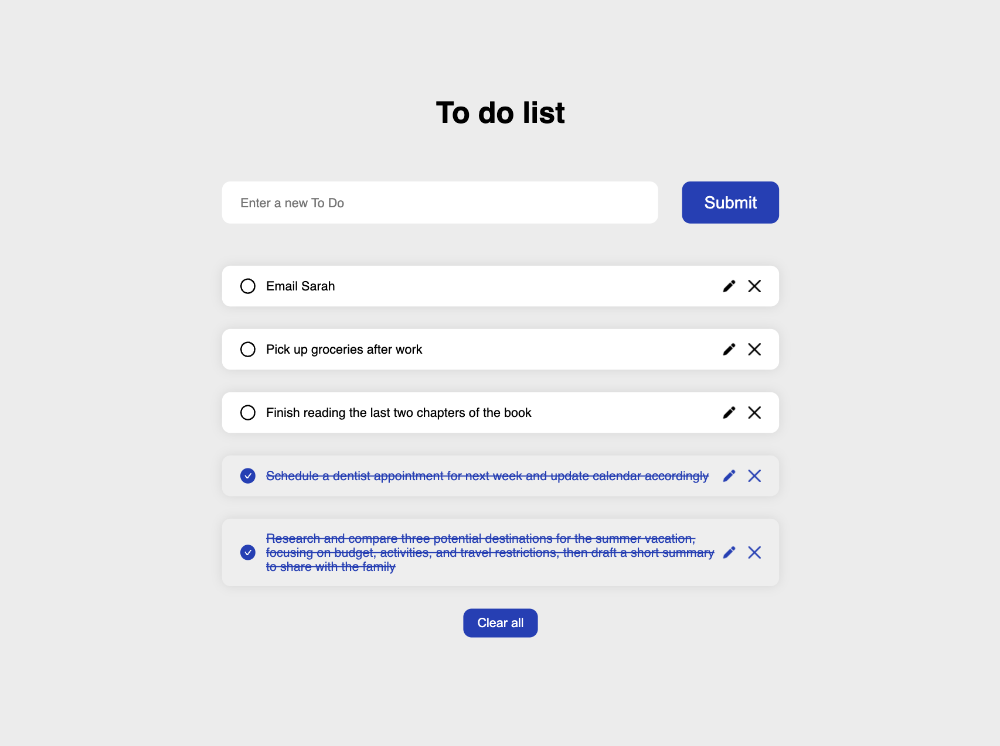

<!-- Title -->
<h1 align="left">Todo App</h1>

<!-- Description -->

This is a simple Todo application built using React. It allows users to create, delete, and toggle completion status of Todo items. The application also utilizes local storage to persist Todo items even after page reloads.

<!-- Design -->
<h2 align="left">Design</h2>

  

<!-- Features -->
<h2 align="left">Features</h2>
<ul align="left">
  <li><strong>Add Todo:</strong> Users can add new Todo items by entering text and clicking the "Submit" button.</li>
  <li><strong>Delete Todo:</strong> Users can delete Todo items by clicking on the delete icon next to each item.</li>
  <li><strong>Edit Todo:</strong> Users can edit existing Todo items by clicking the edit icon and modifying the text.</li>
  <li><strong>Clear All:</strong> When there are more than 5 todos, a "Clear All" button appears to remove all todos at once.</li>
  <li><strong>Local Storage:</strong> Todo items are saved to local storage, allowing them to persist even after the browser window is closed or refreshed.</li>
</ul>

<!-- Technologies Used -->
<h2 align="left">Technologies Used</h2>

React, JavaScript (ES6+), HTML, CSS

<!-- Usage -->
<h2 align="left">Usage</h2>
<ul align="left">
  <li><strong>Adding a Todo:</strong> Enter the text of your new Todo item in the input field and click the "Submit" button.</li>
  <li><strong>Deleting a Todo:</strong> Click on the delete icon next to the Todo item you wish to delete.</li>
  <li><strong>Editing a Todo:</strong> Click on the edit icon next to the Todo item, modify the text, and press Enter or click the edit icon again to save.</li>
  <li><strong>Clearing All Todos:</strong> When you have more than 5 todos, click the "Clear All" button to remove all todos at once.</li>
  <li><strong>Toggling Completion:</strong> Click on the text of a Todo item to mark it as completed or incomplete.</li>
</ul>

<!-- Acknowledgements -->
<h2 align="left">Acknowledgements</h2>

This Todo app was created as part of a learning project and was inspired by various tutorials and resources available online.

